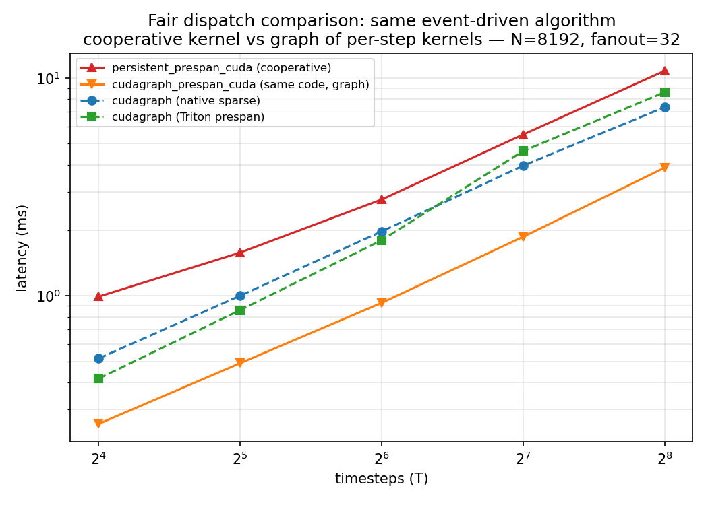

# Persistent kernel vs CUDA graphs — a fair comparison

Date: 2026-07-11 · GPU: RTX 4090 (Ada, shared node) · Env: `micromamba run -n ml-py312`
Data: `results_fair.csv` (one full sweep, all providers, same idle GPU).

**Headline:** with the recurrent algorithm *and implementation* held fixed, the cooperative
`persistent_prespan_cuda` kernel is **~3× slower** than the exact same event-driven CUDA code
dispatched as a graph of ordinary per-step kernels (`cudagraph_prespan_cuda`). So the
persistent kernel's cost is the **cooperative single-launch design itself**, not the algorithm.

> **Hopper note:** hardware here is Ada only; all numbers are Ada. Hopper directions in §4
> are design suggestions, not measured.

---

## 1. The fair comparison

**Which providers share an algorithm?** Only one pair is truly same-code:

| provider | dispatch | recurrent algorithm |
|---|---|---|
| `persistent_prespan_cuda` | cooperative single launch | hand-CUDA prespan, one-thread-per-neuron fan-out |
| `cudagraph_prespan_cuda` | graph of per-step kernels | **identical** hand-CUDA phase code |
| `cudagraph_prespan` | graph of per-step kernels | Triton prespan — same *idea*, different work distribution (2D event×edge tiling over a padded CSR layout) |
| `cudagraph_native_sparse` | graph of per-step kernels | different algorithm — dense `scatter_add` over all edges (spikes as dense) |

So the **controlled** comparison is `persistent_prespan_cuda` vs `cudagraph_prespan_cuda`
alone — same algorithm *and* implementation, only dispatch differs (the stepped op is
literally the cooperative kernel's 4 `grid.sync()` phases split into 4 launches). The other
two are shown for context but are *not* same-code, so they don't isolate dispatch.

**N=8192, fanout=32, event_rate=0.01 (ms):**

| T | persistent_prespan_cuda (cooperative) | **cudagraph_prespan_cuda** (same code, graph) | cudagraph_prespan (Triton) | cudagraph_native (dense) |
|---|---|---|---|---|
| 16 | 0.99 | **0.26** | 0.42 | 0.52 |
| 32 | 1.58 | **0.49** | 0.86 | 1.00 |
| 64 | 2.77 | **0.93** | 1.80 | 1.98 |
| 128 | 5.51 | **1.87** | 4.62 | 3.96 |
| 256 | 10.79 | **3.88** | 8.61 | 7.35 |

- **Same-code, dispatch-only: the cooperative kernel is 2.8–3.8× slower** than the graph of
  per-step kernels. That is the fair answer to "why is the persistent kernel slow": the
  cooperative design, not the prespan algorithm.
- **`cudagraph_prespan_cuda` is the fastest provider overall** — also faster than
  cudagraph_prespan (Triton) and cudagraph_native (dense), but those gaps mix in
  implementation/algorithm differences, not just dispatch.



### Why the cooperative kernel loses

- **Occupancy-capped grid.** `grid.sync()` is only legal if the whole grid is co-resident, so
  the launch is capped by `cudaOccupancyMaxActiveBlocksPerMultiprocessor` (~640 blocks here).
  Ordinary per-step kernels launch at full occupancy for each phase.
- **`grid.sync()` cost.** A grid-wide barrier across all co-resident blocks each of 4 phases ×
  T steps is more expensive than a kernel-launch boundary — and the CUDA graph makes those
  launch boundaries nearly free on replay.
- Net: the cooperative kernel trades away occupancy and cheap barriers to avoid per-step
  launches, but a CUDA graph *already* removes launch overhead — so the trade is a net loss.

---

## 2. Chunked CUDA graphs (avoid full-length capture)

Full-capture graphs must run all T steps once at capture. `ChunkedCUDAGraph{NativeSparse,
PreSpan}Provider` (+ `--chunk-size`) capture one `chunk_size`-step window and replay it
`T/chunk_size` times: recurrent `v`/`psc` carry in place across replays (captured region
copies its own output state to its input buffers), and per-chunk spikes are written to a
full-length history buffer by an *eager* copy between replays. So a 1000-step rollout needs no
full-length capture. Measured ~3–5% overhead vs full-T capture; verified non-trivially
(736k spikes at T=64 ramping across chunks; a reset-state-each-chunk control diverges by 546k
spikes). The persistent kernel has no such issue — one launch, fast from call #1 for any T.


---

## 3. Kernel changes in this round

- **Kept — fold PSC decay into the LIF loop** (`persistent_snn_kernel.cu`): each thread owns
  its `psc[cell]`; decaying it in the LIF loop (before fan-out adds the recurrent term)
  matches the reference and removes a separate grid pass + one `grid.sync()` per step (5→4
  barriers). Measured gain is **marginal** (~1–3%; `results_fair.csv` persistent ≈ the
  original kernel) — the cooperative overhead in §1 dominates.
- **Reverted — warp-per-neuron fan-out.** An earlier round rebalanced the fan-out to warp
  granularity; that changed the work distribution, so it was reverted. **Work balance is left
  exactly as the original one-thread-per-neuron scheme**, by design.
- **Added — `persistent_snn_forward_stepped`** op + 4 standalone step kernels: the same phase
  arithmetic as the cooperative kernel, as ordinary launches, powering `cudagraph_prespan_cuda`.
  Dense-output only, capture-safe (fixed grids, device-side counters, no host readback).

### Correctness

7/7 tests pass. In the sweep, `cudagraph_prespan_cuda` matches the dense reference exactly
(`torch.equal`) at T≤64; at T≥128 it shows the same deterministic ~10/2M near-threshold
fan-out fp-order diff as `persistent_prespan_cuda` (event `atomicAdd` order vs dense matmul; within
`plan.md`'s <1e-4 tolerance). CUDA-graph native/prespan providers match the dense reference
exactly at all T.

---

## 4. Directions

- **Practical takeaway:** for this workload, prefer a **graph of ordinary event-driven kernels**
  over a cooperative persistent kernel — same algorithm, ~3× faster, simpler (no occupancy
  sizing / co-residency constraint). `cudagraph_prespan_cuda` is the recommended path.
- **If the cooperative kernel is still wanted** (e.g. to fuse across steps without any launch/
  graph machinery), the levers are: shrink the grid (only ~330 tasks/step, so full occupancy
  is unnecessary) and cut barriers.
- **Hopper (design only, unmeasured):** cheaper `cluster.sync()` for some barriers;
  thread-block clusters + distributed shared memory to stage hot-`post` accumulation before
  flushing (cuts global atomics); TMA to bulk-load high-fanout edge blocks.

---

## Appendix

Files: `report.md`, `thought_history.md`, `fair_dispatch_comparison.png`,
`chunked_vs_full_capture.png`, `results_fair.csv` (all providers), `results_baseline.csv`
(original kernel reference).

Code: `persistent_snn_kernel.cu` (fold decay; revert warp fan-out; + 4 stepped kernels &
`launch_snn_step`); `persistent_snn.cpp` (`persistent_snn_forward_stepped` op);
`benchmark_rsnn_cudagraph_compare.py` (`cudagraph_prespan_cuda` provider, chunked providers,
`--chunk-size`).

Reproduce:
```bash
export CUDA_VISIBLE_DEVICES=<idle GPU>            # shared node — check nvidia-smi
export CPATH="$CONDA_PREFIX/targets/x86_64-linux/include:$CPATH"
export LIBRARY_PATH="$CONDA_PREFIX/lib:$LIBRARY_PATH"
rm -rf /tmp/btorch_extensions/btorch_persistent_snn_plain   # force rebuild after .cu edits
python benchmark/benchmark_rsnn_cudagraph_compare.py \
  --n-neuron 8192 --t-steps 16 32 64 128 256 --fanout 32 --event-rate 0.01 \
  --chunk-size 16 --warmup 10 --repeat 30 --csv <out>.csv
```
