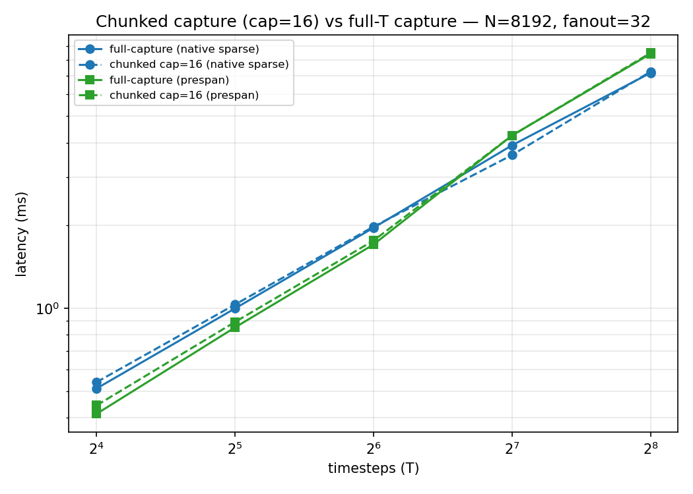
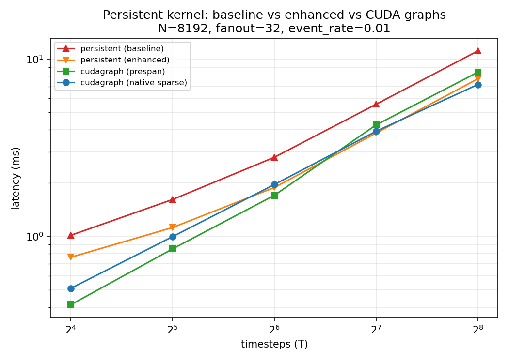

# Chunked CUDA graphs + enhancing the persistent kernel to surpass them

Date: 2026-07-11 · GPU: RTX 4090 (Ada, device 3, shared node) · Env: `micromamba run -n ml-py312`
Repo `btorch.worktree/zhanghan`, on top of `471e7b7`. Data: `results_baseline.csv` /
`results_enhanced.csv` (two back-to-back full sweeps on the same idle GPU).

Three parts: (1) chunked CUDA graphs — replay a short window to cover a long sequence,
no full-length capture; (2) why the persistent kernel was slower; (3) two kernel changes
that make it **beat both CUDA-graph variants at T≥128** and cut latency ~1.4× overall.

> **Hopper note:** hardware here is Ada only. All measurements are Ada. The Hopper
> directions in §4 are design suggestions, **not measured**.

---

## 1. Chunked CUDA graphs

**Problem.** The full-capture providers capture the entire T-step loop, so capture must run
all T steps once for real — costly for a 1000-step rollout, or when T arrives in pieces.

**Fix.** `ChunkedCUDAGraph{NativeSparse,PreSpan}Provider` (+ `--chunk-size`) capture one
`chunk_size`-step window and replay it `T/chunk_size` times:

```python
for c in range(t_steps // chunk_size):
    static_x.copy_(x_seq[c*chunk_size : (c+1)*chunk_size])
    graph.replay()                                          # chunk_size steps, one launch
    history[c*chunk_size : (c+1)*chunk_size].copy_(static_spikes)  # record — eager, dynamic
```

Two points make full-history recording work without full-length capture:
- **State carries in place.** The captured region ends with `static_v0.copy_(out_v)` /
  `static_psc0.copy_(out_psc)`, so `v`/`psc` live at fixed addresses and replay N+1 continues
  from replay N — no Python state threading.
- **History write is eager, between replays**, so it can index any slice of a full-length
  buffer. Recording all T steps doesn't require capturing all T steps.

Requires `chunk_size` to divide `t_steps` (the provider raises otherwise) — a short final
chunk would still run the graph's fixed internal steps and corrupt the tail.

**Cost (cap=16 vs full-T capture, N=8192, fanout=32):** ~3–5% at small T, noise at large T.

| T | native full | native chunked | prespan full | prespan chunked |
|---|---|---|---|---|
| 16 | 0.51 | 0.54 | 0.41 | 0.44 |
| 64 | 1.96 | 1.98 | 1.71 | 1.76 |
| 256 | 7.17 | 7.25 | 8.41 | 8.48 |

**Correctness (verified non-trivially):** chunked spikes `torch.equal` the dense reference
(0 mismatches) with substantial activity (736k spikes at T=64, ramping across chunks); a
control that wrongly resets state each chunk diverges by 546k spikes, so the test genuinely
exercises the cross-chunk state chaining.



**The persistent kernel has no such issue** — it's one `cudaLaunchCooperativeKernel` that
loops all T steps internally, fast from the first call for any T. Chunking is a
graph-of-ordinary-kernels concern only.

---

## 2. Why the persistent kernel was slower

Baseline persistent vs best CUDA graph: 2.5× (T=16) → 1.4–1.5× (T≥128). The prior report
already removed the fixed floor; what remained is the recurrent fan-out phase (Task 3):

```cpp
while (true) {
    const int task = atomicAdd(work_counter, 1);   // EVERY grid thread, every iteration
    if (task >= *spike_count || task >= queue_capacity) break;
    ... one thread walks this neuron's WHOLE edge list serially ...
}
```

Three per-step problems, invisible to `nsys` (inside one kernel):
1. **`work_counter` atomic storm** — ~160K grid threads each `atomicAdd` one global int, though only ~330 neurons spike/step (~99.8% wasted).
2. **Underutilization** — only ~330 threads do fan-out work.
3. **Serial edge walk** — one thread per neuron; catastrophic for the production graph's skew (avg ~177, P99 ~1911, max ~4165), and the trailing `grid.sync()` waits for the slowest.

Plus a redundant grid barrier: a separate pass just for `psc *= decay` (5 barriers/step).

---

## 3. Two enhancements (`persistent_snn_kernel.cu`)

**A. Fold PSC decay into the LIF loop.** Each thread owns its `psc[cell]`; the reference
order is "current uses old psc, then `psc = psc*decay + recurrent`". The LIF loop already
reads `psc[cell]`, so `psc[cell] *= decay` right there (before fan-out adds the recurrent
term) reproduces it, deleting a separate grid pass + `grid.sync()` (5→4 barriers).

**B. Warp-per-neuron work-stealing fan-out.** Lane 0 claims a task with one atomicAdd (32×
fewer), broadcasts via `__shfl_sync`, and 32 lanes walk the edge list in parallel:

```cpp
const int lane = global_tid & 31;
while (true) {
    int task = 0;
    if (lane == 0) task = atomicAdd(work_counter, 1);
    task = __shfl_sync(0xffffffffu, task, 0);
    if (task >= count || task >= queue_capacity) break;
    ...
    for (int edge = start + lane; edge < end; edge += 32) atomicAdd(psc + ..., weight);
}
```

Correct: `blockDim.x`=256 (multiple of 32) so warps are full and the mask is valid; `task`
is broadcast so the warp breaks together and reaches `grid.sync()`; each edge is handled by
exactly one lane, so the multiset of `psc` atomicAdds is unchanged. Work stealing keeps
skewed fanout balanced.

**Results (N=8192, fanout=32, event_rate=0.01):**

| T | baseline | **enhanced** | speedup | cudagraph_prespan | cudagraph_native |
|---|---|---|---|---|---|
| 16 | 1.02 | **0.76** | 1.33× | 0.41 | 0.51 |
| 32 | 1.62 | **1.12** | 1.44× | 0.85 | 1.00 |
| 64 | 2.79 | **1.89** | 1.48× | 1.71 | 1.96 |
| 128 | 5.55 | **3.82** | 1.45× | 4.25 | 3.91 |
| 256 | 11.09 | **7.72** | 1.44× | 9.19 | 7.17 |

- **T=128: enhanced beats both graphs** (3.82 vs 4.25/3.91); **T=256: beats prespan** (7.72 vs 9.19), within 8% of native.
- Small T still floor-limited (launch overhead, not fan-out) — see §4.
- ~1.4× consistent, matching the per-step nature of the fixes.



**Correctness.** 7/7 tests pass. Enhanced spikes are **bit-identical to baseline** (verified:
at T=128 both differ from the dense reference on the exact same 10 `(t,b,n)` cells, agree
elsewhere), so the change does not alter output. T≤64 match the dense reference exactly
(`torch.equal`). At T≥128, ~10 of ~2M spikes differ from the dense reference — a
**deterministic** float accumulation-order effect (event `atomicAdd` order vs dense matmul;
runs are byte-identical run-to-run), near-threshold cells resolving the other way, ~5e-6 of
total, within `plan.md`'s <1e-4 state tolerance. Present identically in baseline; the
CUDA-graph providers match the dense reference exactly (they reuse the dense summation order).

---

## 4. Further directions

**Small-T floor (Ada, not yet done):** wrap the persistent kernel in a CUDA graph, or shrink
the cooperative grid (only ~330 tasks/step) to cut launch + `grid.sync()` cost.

**Hopper (design only, unmeasured):** thread-block clusters + distributed shared memory to
stage hot-`post` accumulation before flushing (cuts global atomics); cheaper `cluster.sync()`
for some of the 4 barriers; TMA to bulk-load high-fanout edge blocks.

---

## Appendix

Files: `report.md`, `chunked_vs_full_capture.png`, `persistent_baseline_vs_enhanced.png`,
`results_baseline.csv`, `results_enhanced.csv`.

Changes: `benchmark_rsnn_cudagraph_compare.py` (chunked providers + `--chunk-size`);
`persistent_snn_kernel.cu` (fold decay; warp-per-neuron work-stealing fan-out).

Reproduce:
```bash
export CUDA_VISIBLE_DEVICES=<idle GPU>            # shared node — check nvidia-smi
export CPATH="$CONDA_PREFIX/targets/x86_64-linux/include:$CPATH"
export LIBRARY_PATH="$CONDA_PREFIX/lib:$LIBRARY_PATH"
rm -rf /tmp/btorch_extensions/btorch_persistent_snn_plain   # force rebuild after .cu edits
python -m pytest tests/benchmark/test_persistent_snn_cuda.py tests/benchmark/test_persistent_snn_stub.py -q
python benchmark/benchmark_rsnn_cudagraph_compare.py \
  --n-neuron 8192 --t-steps 16 32 64 128 256 --fanout 32 --event-rate 0.01 \
  --chunk-size 16 --warmup 10 --repeat 30 --csv <out>.csv
```
Baseline row: check out `471e7b7`'s kernel, `rm -rf` the extension dir, re-run.
